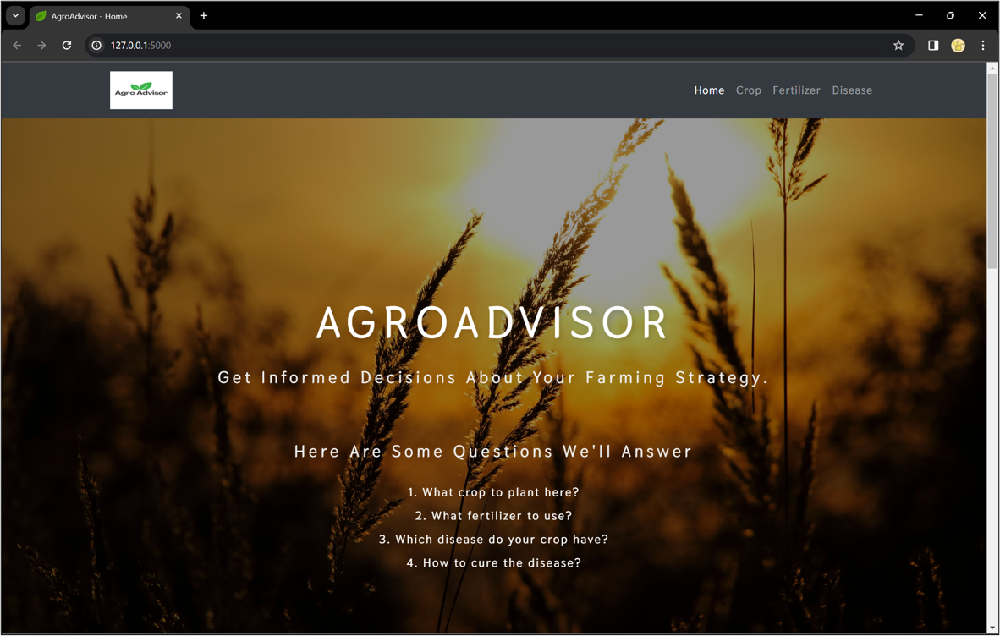
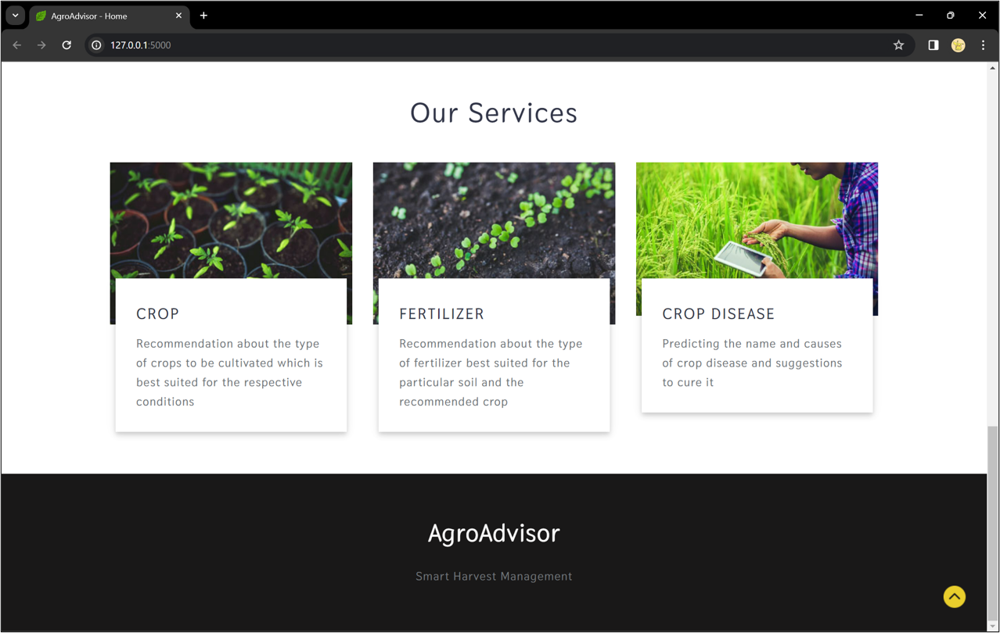
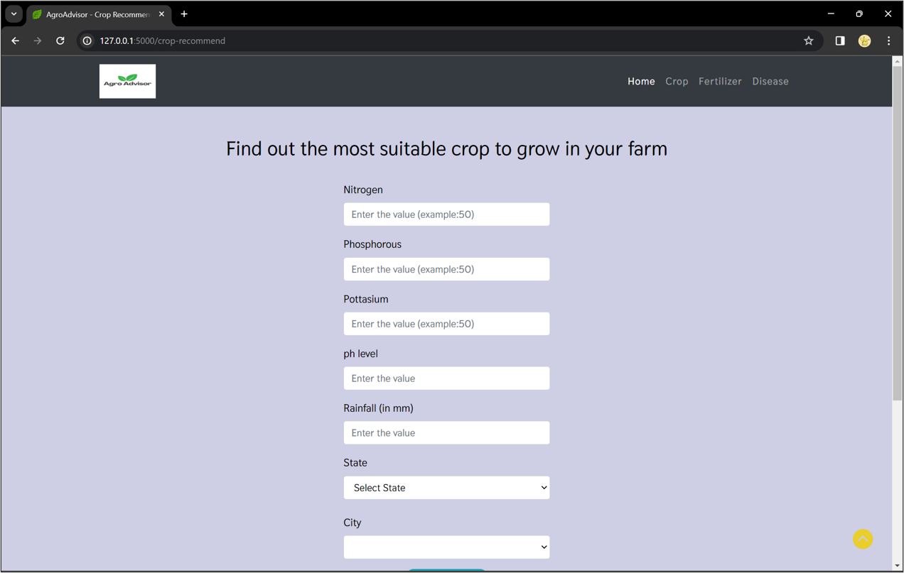
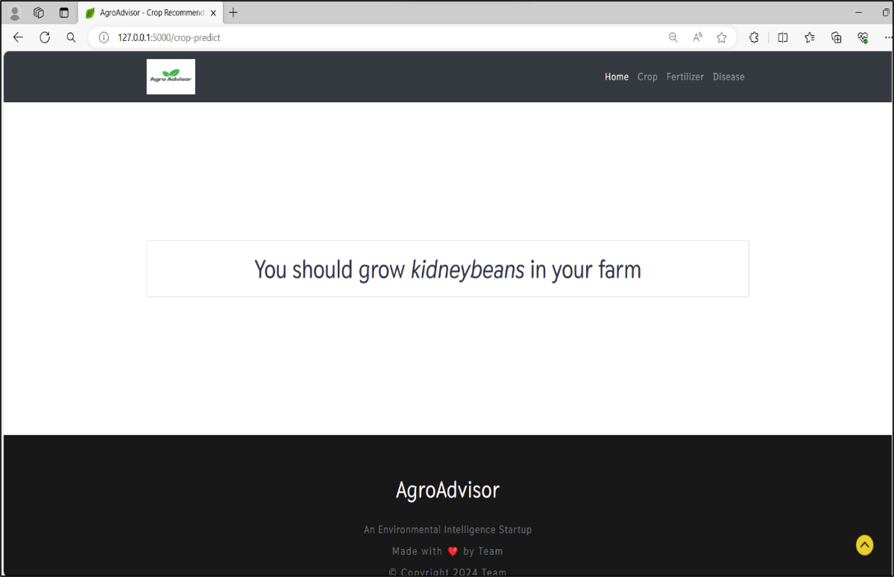
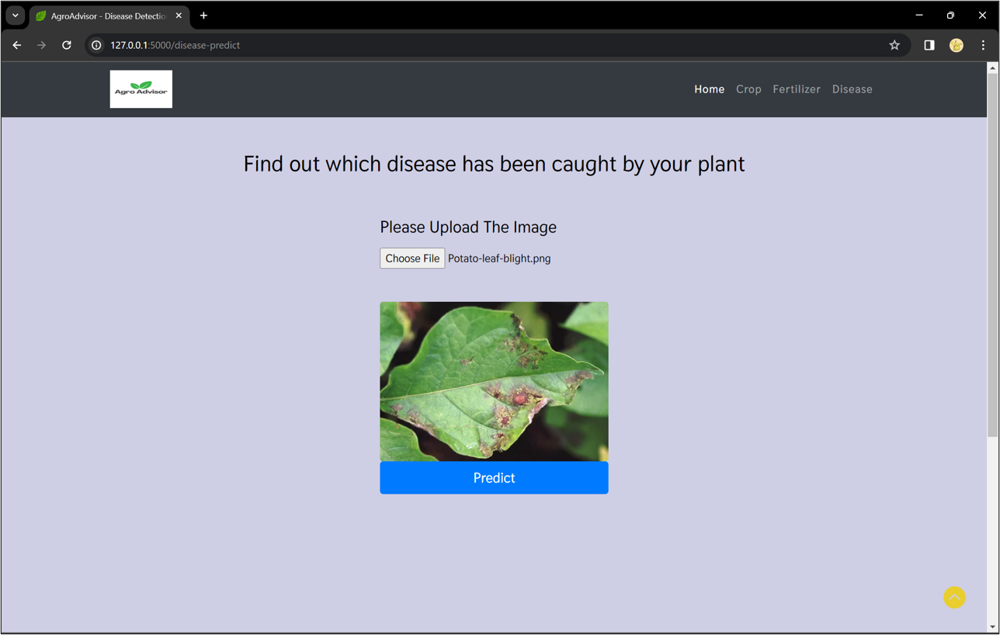
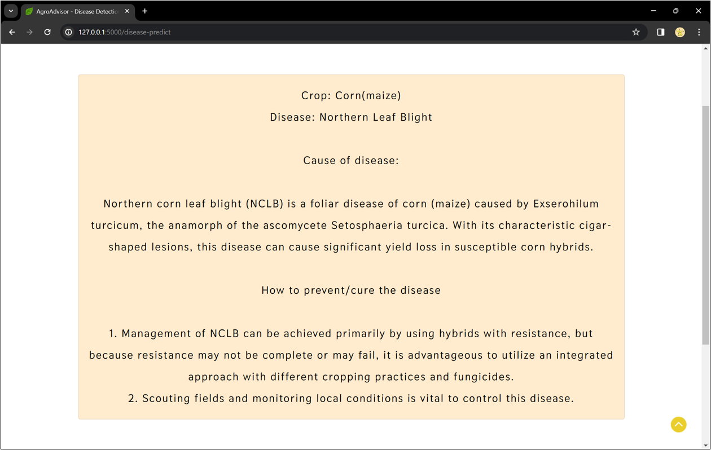

# 🌾 AgroAdvisor

AgroAdvisor is a machine learning and deep learning-based website that assists farmers and agricultural professionals by recommending the **best crop to grow**, **appropriate fertilizers**, and detecting **plant diseases** using computer vision.

---

## 📊 Data Sources

- [Crop Recommendation Dataset](https://www.kaggle.com/datasets/atharvaingle/crop-recommendation-dataset)  
- [Plant Diseases Dataset](https://www.kaggle.com/datasets/vipoooool/new-plant-diseases-dataset)

---

## 💻 Features & How to Use

### 🚜 Crop Recommendation
Enter:
- **N-P-K** values (Nitrogen-Phosphorous-Potassium) — Refer to [this guide](https://www.gardeningknowhow.com/garden-how-to/soil-fertilizers/fertilizer-numbers-npk.htm)
- **State** and **City**

🔔 Note: Use commonly known cities. Some remote areas may not be supported by the [OpenWeatherMap API](https://openweathermap.org/).

---

### 🌿 Fertilizer Suggestion
Provide:
- **Soil nutrients**
- **Target crop**

The model will suggest adjustments in fertilizer usage based on nutrient excess or deficiency.

---

### 🦠 Disease Detection
Upload:
- A **leaf image** of the crop

The system detects:
- Crop type
- Health status (Healthy/Diseased)
- Disease name and treatment suggestions

<details>
<summary>Supported Crops</summary>

- Apple  
- Blueberry  
- Cherry  
- Corn  
- Grape  
- Pepper  
- Orange  
- Peach  
- Potato  
- Soybean  
- Strawberry  
- Tomato  
- Squash  
- Raspberry  

</details>

---

## 🛠️ Run Locally

### Requirements:
- `git`
- Anaconda or Miniconda

### Step 1: Clone the Repository

```bash
git clone https://github.com/your-username/AgroAdvisor.git
cd AgroAdvisor
```

### Step 2: Set Up Environment

```bash
conda create -n agroadvisor python=3.6.12
conda activate agroadvisor
pip install -r requirements.txt
```

### Step 3: Launch the App

```bash
python app.py
```

Then, open the URL shown in your terminal (usually http://127.0.0.1:5000).

---

## 🖼️ Screenshots

**1. Homepage**  


**2. Our Services**  


**3. Crop Recommendation Input**  


**4. Recommended Crop Output**  


**5. Disease Detection Upload**  


**6. Diagnosis and Treatment Info**  


---

## 📈 Future Improvements

- Expand disease support to more crops  
- Add regional language support  
- Integrate real-time weather-based decision-making  
- IoT integration for smart soil monitoring  

---

## 🪪 License

This project is licensed under the MIT License. See the [LICENSE](LICENSE) file for details.
